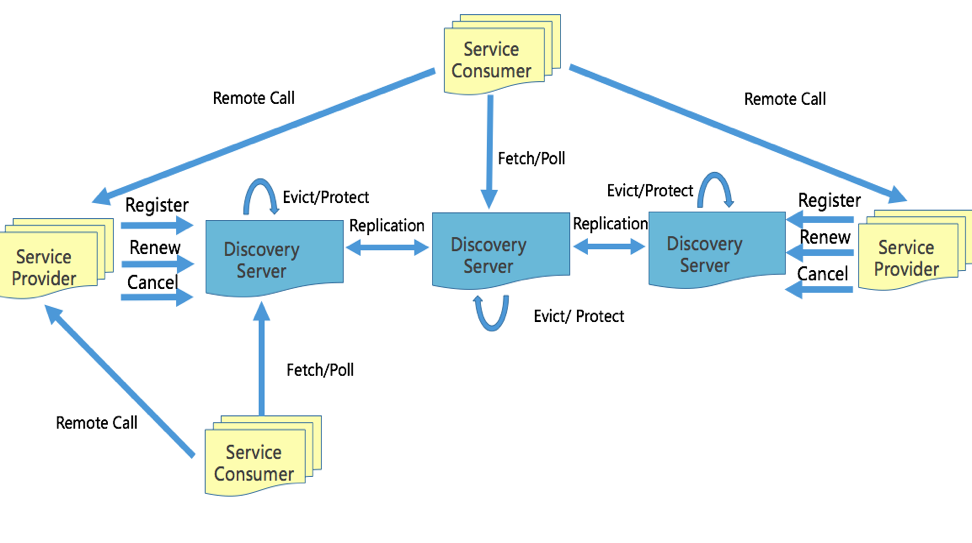

# Discovery 

Discovery is a based service that is production-ready and primarily used at [Bilibili](https://www.bilibili.com/) for locating services for the purpose of load balancing and failover of middle-tier servers.

## 背景

* 团队是B站主站技术，位于上海的狂热Gopher
* 之前一直使用zookeeper作为服务注册发现中间件，但由于zookeeper：
    * Java系，在我们这群基佬Gopher看来太重、维护不动、无法二次开发
    * CP系统，对于微服务的服务注册发现，其实不如一套AP系统更可用
* 运维小锅锅们大力推进业务向k8s的迁移，zk无法满足迭代需求
* 也考虑过直接使用现有的如consul、etcd，但：
    * consul一直被运维小锅用于nginx+upsync，坑多让我们慎用
    * etcd相对来说是k8s体系，非常合适，但讨论下来，我们更想要一套纯纯的AP系统，无视kv。。

_补充资料：[Why You Shouldn’t Use ZooKeeper for Service Discovery](https://medium.com/knerd/eureka-why-you-shouldnt-use-zookeeper-for-service-discovery-4932c5c7e764)_

## 设计目标

Netflix Eureka简直是服务注册发现领域AP系统的标杆，我们打算大力借（抄）鉴（袭）~~

1. 实现AP类型服务注册发现系统，在可用性极极极极强的情况下，努力保证数据最终一致性
2. 与公司k8s平台深度结合，注册打通、发布平滑、naming service(有bns服务...bilibili naming service，敬请期待开源)等等
3. 网络闪断等异常情况，可自我保护，保证每个节点可用
4. 基于HTTP协议实现接口，简单易用，维护各流行语言SDK
    * Go SDK请看仓库内naming目录
    * Java SDK请看仓库[DiscoveryJavaSDK](https://github.com/felixhao/DiscoveryJavaSDK)

## 设计概览

### 基本概念

0. 通过AppID(服务名)和hostname定位实例
1. Node: discovery server节点
2. Provider: 服务提供者，目前托管给k8s平台，容器启动后发起register请求给Discover server，后定期（30s）心跳一次
3. Consumer: 启动时拉取node节点信息，后随机选择一个node发起long polling(30s一次)拉取服务instances列表
4. Instance: 保存在node内存中的AppID对应的容器节点信息，包含hostname/ip/service等

### 架构图

### 重要步骤

1. 心跳复制(Peer to Peer)，数据一致性的保障：
    * AppID注册时根据当前时间生成dirtyTimestamp，nodeA向nodeB同步(register)时，nodeB可能有以下两种情况：
        * 返回-404 则nodeA携带dirtyTimestamp向nodeB发起注册请求，把最新信息同步：
            1. nodeB中不存在实例
            2. nodeB中dirtyTimestamp较小
        * 返回-409 nodeB不同意采纳nodeA信息，且返回自身信息，nodeA使用该信息更新自身
    * AppID注册成功后，Provider每(30s)发起一次heartbeat请求，处理流程如上
2. Instance管理
    * 正常检测模式，随机分批踢掉无心跳Instance节点，尽量避免单应用节点被一次全踢
    * 网络闪断和分区时自我保护模式
        * 60s内丢失大量(小于Instance总数*2*0.85)心跳数，“好”“坏”Instance信息都保留
        * 所有node都会持续提供服务，单个node的注册和发现功能不受影响
        * 最大保护时间，防止分区恢复后大量原先Instance真的已经不存在时，一直处于保护模式
3. Consumer客户端
    * 长轮询+node推送，服务发现准实时
    * 订阅式，只需要关注想要关注的AppID的Instance列表变化
    * 缓存实例Instance列表信息，保证与node网络不通等无法访问到node情况时原先的Instance可用

### 多注册中心

* 机房定义为zone，表示“可用区”（可能两个相邻机房通过牛逼专线当一个机房用呢~~所以没用IDC~~）
* zoneA将zoneB的SLB入口地址当做一个node(只是不需要同步信息)
    * 如zoneA内有node1,node2,node3，zoneB内有nodeI,nodeII,nodeIII
    * zoneA入口zoneA.bilibili.com，zoneB入口zoneB.bilibili.com
    * zoneA将zoneB.bilibili.com配入本身，当做一个特殊node，同时zoneB将zoneA.bilibili.com配入本身当做特殊node（请参考配置文件内zones）
* 跨zone同步数据时，单向同步，zoneB.bilibili.com收到信息后，zoneB的nodeI,nodeII,nodeIII只做内部广播，不会再次向zoneA.bilibili.com广播

## 相对Netflix Eureka的改进

* 长轮询监听应用变更（Eureka定期30s拉取一次）
* 只拉取感兴趣的AppID实例（Eureka一拉就是全部，无法区分）
* 合并node之间的同步请求/(ㄒoㄒ)/~~其实还没实现，是个TODO
* Dashboard骚操作~
* 多注册中心信息同步支持
* 更完善的日志记录

PS：[Eureka2.0](https://github.com/Netflix/eureka/wiki/Eureka-2.0-Motivations)以上功能基本也要实现，但难产很久了/(ㄒoㄒ)/~~
